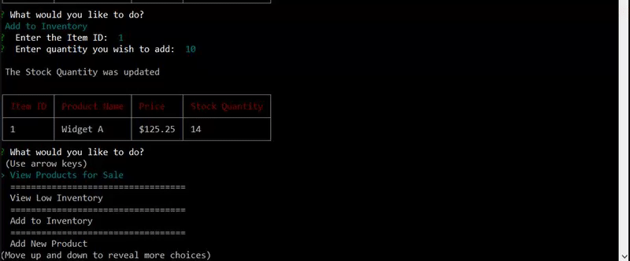

# bamazon

Description:

This program contains two different modules. One for the customer and the other for the manager.  It uses node.js and MySQL database. To use these programs, you will need to do the following:
* Go to Git Bash 
* Initialize the npm package, npm init
* Install inquirer, cli-tables (npm i inquirer cli-tables)
* To run the customer module: node bamazonCustomer.js
* To run the Manager module: node bamazonManager.js

Customer module lists the inventory for sale including product name, price and quantity available.

Order Inventory:

Not enough Inventory:

The Manager Module allows you to View the available inventory, View low inventory with less than 5 pieces in inventory, add more quantity and add new products.

For the Manager Module:

To view the inventory:

To view low inventory:

To add quantity to inventory:

To add new products to inventory:

